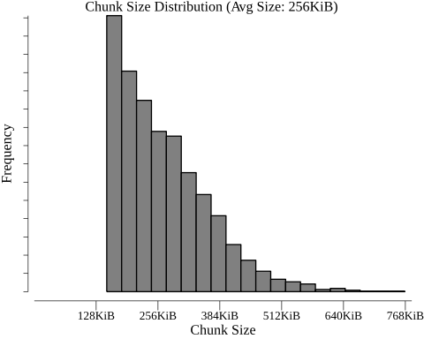
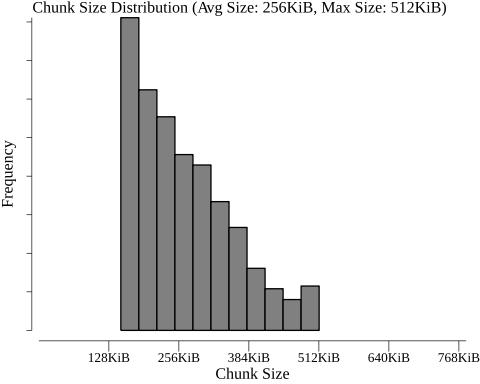

# AE Chunker (GO)

[](https://pkg.go.dev/github.com/mg98/ae-chunker-go)
[](https://github.com/mg98/ae-chunker-go/actions/workflows/test.yml)
[](https://codecov.io/gh/mg98/ae-chunker-go)
[](https://goreportcard.com/report/github.com/mg98/ae-chunker-go)


**ae-chunker-go** is a best-effort Go implementation of the chunking algorithm presented in
_AE: An Asymmetric Extremum Content Defined
Chunking Algorithm for Fast and
Bandwidth-Efficient Data Deduplication_
by Yucheng Zhang et al. ([PDF](https://ranger.uta.edu/~jiang/publication/Conferences/2015/2015-INFOCOM-AE-%20An%20Asymmetric%20Extremum%20Content%20Defined%20Chunking%20Algorithm%20for%20Fast%20and%20Bandwidth-Efficient%20Data%20Deduplication.pdf)).

## Install

```
go get -u github.com/mg98/ae-chunker-go
```

## Example

```go
import (
    "bytes"
    "fmt"
    "io"
    "log"
    "math/rand"
    "time"
    "github.com/ae-chunker-go"
)

func main() {
    data := make([]byte, 1024*1024)  // 1 MiB
    rnd := rand.New(rand.NewSource(time.Now().Unix()))
    if _, err := rnd.Read(data); err != nil {
        log.Fatal(err)
    }

    chunker := ae.NewChunker(bytes.NewReader(data), &ae.Options{
    	AverageSize: 256*1024,  // 256 KiB
    	MaxSize: 512*1024,      // 512 KiB
    })
    var chunks [][]byte
    for {
    	chunk, err := chunker.NextBytes()
    	if err == io.EOF {
    		break
        } else if err != nil {
        	log.Fatal(err)
        }
        chunks = append(chunks, chunk)
    }
    
    fmt.Printf(
        "Data divided into %d chunks. First chunk is %d bytes.\n",
        len(chunks),
        len(chunks[0]),
    )
    // Example output: Data divided into 5 chunks. First chunk is 224098 bytes.
}
```

## Performance

The task was to divide 100 MiB of random bytes into chunks with an average size of 256 KiB
(CPU: _Intel(R) Core(TM) i7-8750H CPU @ 2.20GHz_).

| Chunking Algorithm | Speed | Processed Bytes | Allocated Bytes | Distinct Mem. Alloc. |
|--------------------|------:|----------------:|----------------:|---------------------:|
| ae-chunker-go                                                         | 148 sec/op | 707.01 MB/s | 848 MB/op | 535331 allocs/op |
| [fastcdc-go](https://github.com/jotfs/fastcdc-go)                   | 82 sec/op | 1285.59 MB/s | 2 MB/op | 3 allocs/op |
| [go-ipfs-chunker](https://github.com/ipfs/go-ipfs-chunker) (Rabin)      | 416 sec/op  | 252.02 MB/s | 108 MB/op | 1153 allocs/op |
| [go-ipfs-chunker](https://github.com/ipfs/go-ipfs-chunker) (Buzhash)    | 82 sec/op | 1281.50 MB/s | 107 MB/op | 415 allocs/op |
| [go-ipfs-chunker](https://github.com/ipfs/go-ipfs-chunker) (Fixed Size) | 19 sec/op | 5502.19 MB/s | 105 MB/op | 405 allocs/op |


## Chunk Size Variance

The following plots show the chunk size distribution on a set of random bytes of 1 GiB.
The algorithm was run with the options 
`&ae.Options{AverageSize: 256*1024}` and `&ae.Options{AverageSize: 256*1024, MaxSize: 512*1024}`,
respectively.

 
